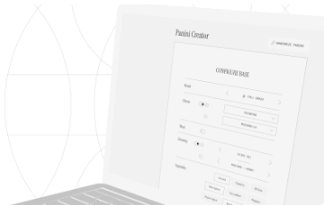
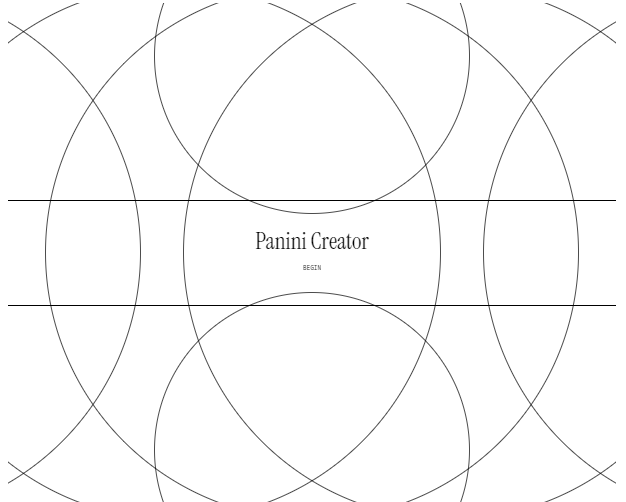
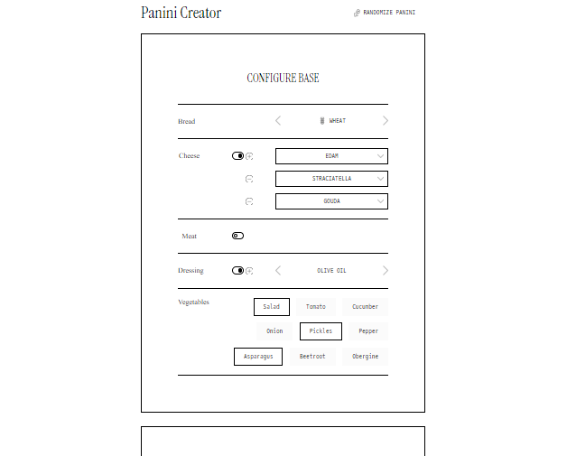
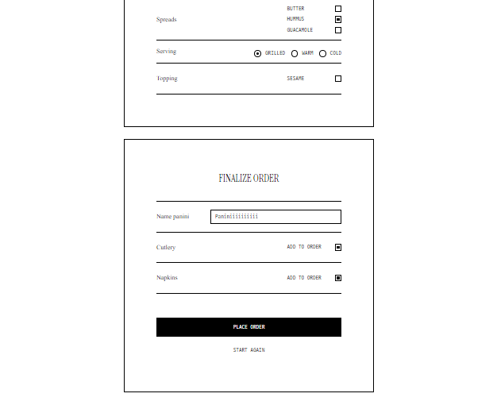

<h1 align="center">
  Panini Creator 🥪
  <p align="center">
    
  </p>
</h1>
<p align="center">
  <a href="#introduction">Introduction</a> •
  <a href="#features">Features</a> •
  <a href="#technologies">Technologies</a> •
  <a href="#getting-started">Getting Started</a> •
  <a href="#live-demo">Live Demo</a> •
  <a href="#screenshots">Screenshots</a> •
  <a href="#credits">Credits</a>
</p>

<br><br><br>

## Introduction

Master forms in React by creating a sandwich configurator using React Hook Form, and Zod. Panini Creator is a unique application that allows users to build their perfect sandwich through an engaging and interactive interface.
<br><br>

## Features

**· Customizable Sandwich Building:** Choose from a variety of ingredients to build your perfect sandwich.

**· Interactive Forms:** Utilize React Hook Form for efficient and user-friendly form handling.

**· Smooth Animations:** Framer Motion is used to provide a dynamic, engaging user experience.

**· Responsive Design:** Fully functional on both desktop and mobile devices.

**· Reusable Components:** Carousel, dropdowns, checkboxes, and more for an efficient, modular design.

<br><br>

## Technologies

**· React.js**

**· React Hook Form**

**· Zod**

**· Framer Motion**

**· Sass**

**· Classnames**

**· React Router Dom**
<br><br>

## Getting Started

**1. Clone the Repository**

```bash
https://github.com/wawrzonnn/panini-creator.git
```

**2. Install Dependencies**

```bash
npm install
```

**3. Run the Application**

```bash
npm run dev
```

The application will be running on **http://localhost:5173.**
<br><br>

## Live Demo

Experience Panini Creator in action: [Live Demo Link](https://panini-creator.vercel.app/)
<br><br>

## Screenshots

#### ◇ Welcome Screen

<p align="center">
  <a href="./docs/welcomeBig.png">
    
  </a>
</p>

#### ◇ Configurator

<p align="center">
  <a href="./docs/from1Big.png">
    
  </a>
</p>


<p align="center">
  <a href="./docs/form2Big.png">
    
  </a>
</p>
<br><br>

## Credits

Design provided by [Nerdbord.io](https://nerdbord.io).
